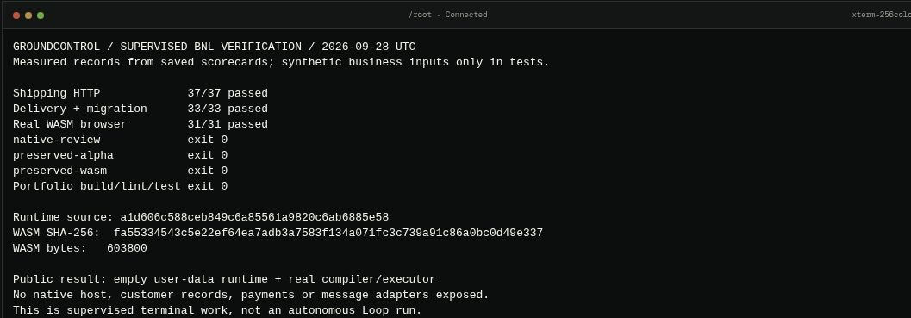

# Shipping a real BNL playground through GroundControl

Recorded 28 September 2026. This is a supervised operator workflow through the live GroundControl terminal. It is not an autonomous Loop run, a built-in BNL integration, or a new CI service.

The goal was concrete: make Backend as Natural Language testable on the existing portfolio while the developer was away from their computer. Visitors needed to supply their own records and execute the real compiler and runtime. A screen populated with fictional customers would not meet that goal.

## GroundControl provided the working host

The authenticated terminal gave access to a persistent shell on the selected VPS. Rust compilation, locked-dependency tests and browser acceptance ran in resource-bounded Docker containers on that host. The Rust image used version 1.88; browser acceptance used Playwright 1.57 and Chromium 143; the portfolio built with Node 24.

GroundControl was the operator surface. GitHub remained the source and review system. The portfolio's existing Vercel integration published the merged site. This separation matters: a successful shell command, a passing test suite and a working public route are distinct observations.



*Figure 1. A terminal summary read from saved scorecards: shipping HTTP 37/37, delivery/migration 33/33 and actual-WASM browser acceptance 31/31. The viewport is cropped to omit infrastructure identifiers and the shell prompt. These are recorded test outcomes, not built-in GroundControl counters. No values were painted into the screenshot.*

## The public interface runs the actual engine

A separate Rust wrapper invokes BNL's existing compiler, typed BIR validator, planner and guarded executor. Its WebAssembly build starts with an empty Store. Visitors load customer, order, subscription and invoice records; exact type and relationship checks run before an import replaces the current state.

The public wrapper permits local reads, tasks, reviews and idempotency markers. Payments and messages reject before execution. A dedicated worker owns each tab's state, bounded requests and memory; teardown discards that state. No native administrative host or production credentials are exposed.


*Figure 2. The public production route after portfolio release cb61c49e5fe133ee465d13f4e965af4511443721. The initial record count is zero. Starter declarations provide grammar; visitors supply the business values.*

## Verify a consequence, not just a page load

The browser suite changed imported rows and declaration ordering, then checked the actual results. It exercised nominal-type rejection, atomic import, rollback after a staged write, committed local tasks, separate-tab isolation, exports, worker failure, keyboard controls and a 390px mobile viewport. The final suite passed 31 checks; the existing portfolio suite passed all 30 tests, and build/lint passed.

After deployment, a fresh public session compiled and executed this declaration:

```bnl
Compose LiveRuleCheck
Input days: integer
Check eligible when $input.days > 30
Return eligible
```

An explicitly supplied integer input of 31 returned true; changing it to 12 returned false. These were verification inputs, not fabricated customer records. The visible runtime identity matched the tested artifact.


*Figure 3. The real compiler/executor returned Boolean false for days = 12. No business records were needed. The screenshot also shows the source revision and binary digest.*

## Keep failures with the success

The first container command lacked Cargo on its login-shell PATH. Packaging initially could not resolve a linked worktree's host-side Git metadata. Both failures were retained; the build used Cargo's container path and packaging ran in the actual Git checkout.

The first browser run checked an article before the animated route had mounted. Its scorecard remains beside the corrected test. A later review also corrected stale export-request provenance after runtime restart and verified it in the final browser suite.

The native delivery review found a separate liveness defect: a batch smaller than the configured route count could starve later routes. The correction requires at least one batch slot per route and passed 7 host Rust tests, 37 shipping HTTP checks and 33 delivery/migration checks. That native path is separate from the public browser runtime and remains under its own review.

## What another operator can repeat

1. Pin the source revision and build inputs before running tests.
2. Use the authenticated GroundControl terminal and an isolated checkout. Run explicit build/test commands in containers with resource limits.
3. Save command exit codes, scorecards, artifact hashes and screenshots. Label test inputs and retain failed attempts.
4. Publish through the application's existing review/deployment path.
5. Open the public route independently, change an input and verify its consequence. Archive that observation separately from local test success.

This uses GroundControl's live VPS/terminal foundation. It does not establish autonomous recovery, production payment/message delivery, or independent language generalisation. Loop remains the intelligence/recovery engine inside GroundControl; the test runner here was an operator-invoked tool.

## Evidence and ways to try it

- [Live playground](https://precisionxyz.serendepify.com/#/playground/bnl)
- [Getting started](https://precisionxyz.serendepify.com/#/article/bnl-getting-started)
- [Public portfolio evidence at the released commit](https://github.com/teckedd-code2save/edward.entire/tree/cb61c49e5fe133ee465d13f4e965af4511443721/docs/evidence/bnl-playground-2026-09-28)
- [Screenshot registry and captions](../screenshots/bnl-2026-09-28/README.md)
- [Current terminal source reviewed for this article](https://github.com/teckedd-code2save/groundcontrol/blob/68e2c230576ded23b7554d7ca8622338ae832ea0/src/app/terminal/page.tsx)

BNL runtime source: a1d606c588ceb849c6a85561a9820c6ab6885e58. WASM SHA-256: fa55334543c5e22ef64ea7adb3a7583f134a071fc3c739a91c86a0bc0d49e337; 603800 bytes. The BNL source repository remains private and has no selected public source license. Detailed native logs remain in its evidence archive; the public portfolio archive contains browser/build outcomes suitable for public documentation.
